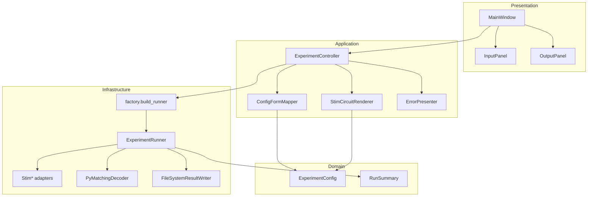
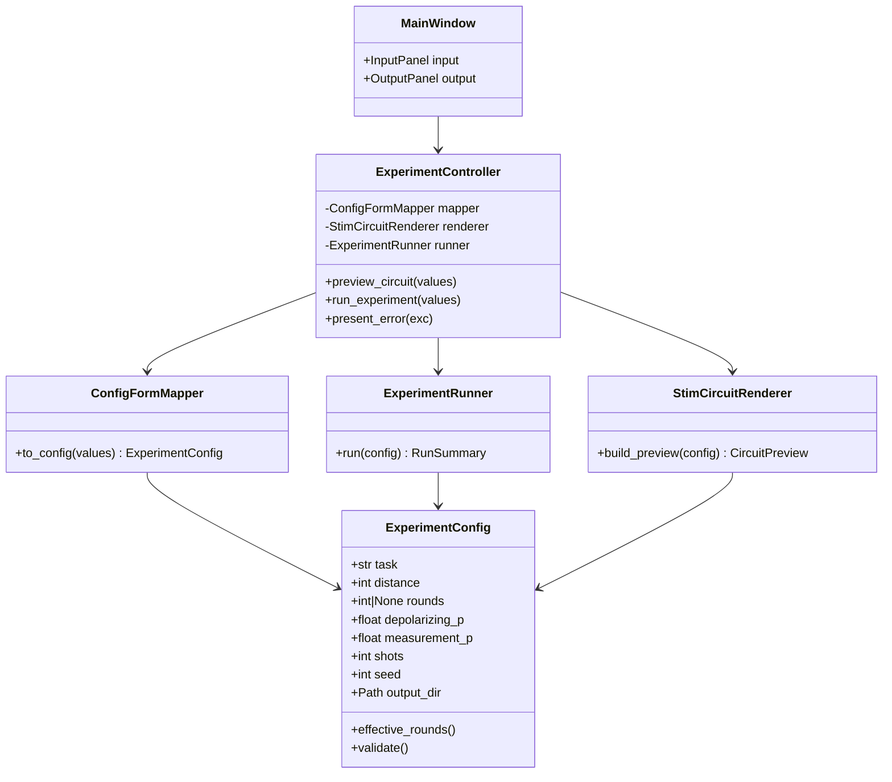
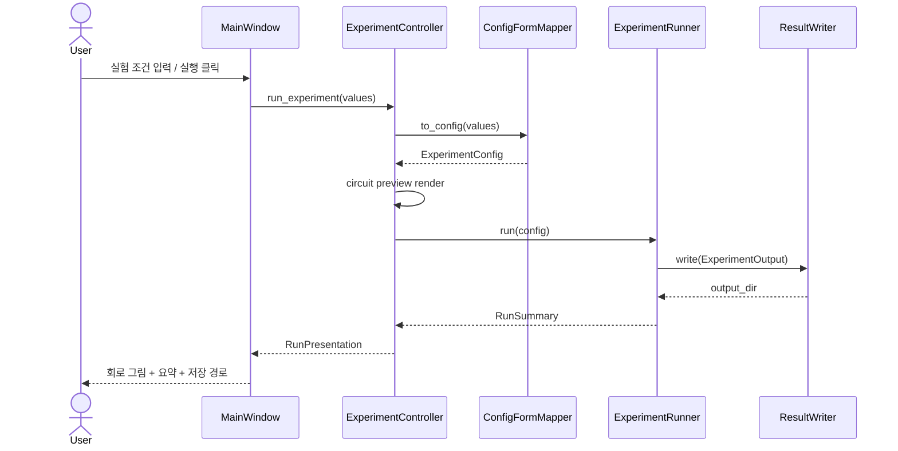

# QEC Quantum Simulator — 개발 설명서

> ChatGPT「양자 AI 연구」프로젝트에 붙여 넣을 수 있는 개발 설명 문서입니다.  
> (본 환경에서는 사용자 ChatGPT 계정에 직접 대화창을 생성할 수 없어, 동일 내용을 파일로 제공합니다.)

## 1. 프로그램 목적

`qec_sim`은 Stim 기반 surface-code QEC(양자 오류 정정) 시뮬레이션을 수행하고,
syndrome 데이터셋·회로·DEM·디코더 예측·metadata를 파일로 저장하는 연구용 도구입니다.

기존에는 CLI(`cli.py`)만 제공되었으나, 일반 사용자를 위해 **크로스 플랫폼 GUI**와
**실행 파일 패키징**을 추가했습니다.

## 2. 디렉터리 구조

```
qec/
├── src/qec_sim/
│   ├── domain.py              # ExperimentConfig 등 도메인 모델
│   ├── ports.py               # Protocol(Port) 인터페이스
│   ├── stim_backend.py        # Stim 어댑터
│   ├── pymatching_backend.py  # PyMatching 어댑터
│   ├── runner.py              # ExperimentRunner (유스케이스)
│   ├── factory.py             # Composition Root (DI 조립)
│   ├── cli.py                 # CLI 진입점
│   └── gui/                   # GUI (SOLID 계층)
│       ├── app.py
│       ├── controllers/
│       ├── views/
│       ├── services/
│       └── widgets/
├── gui_entry.py               # PyInstaller 진입 스크립트
├── packaging/qec_sim_gui.spec
├── scripts/build_gui_linux.sh
├── scripts/build_gui_windows.bat
└── docs/
```

## 3. 핵심 도메인: ExperimentConfig

`domain.py`의 `ExperimentConfig`가 GUI 입력의 단일 소스입니다.

| 필드 | 의미 |
|------|------|
| `task` | Stim generated circuit 종류 |
| `distance` | surface-code code distance (≥2) |
| `rounds` | stabilizer measurement 반복 (None이면 distance) |
| `depolarizing_p` | Clifford 후 depolarizing 확률 [0,1] |
| `measurement_p` | 측정 flip 확률 [0,1] |
| `shots` | Monte Carlo sample 수 |
| `seed` | 재현성용 난수 시드 |
| `output_dir` | 결과 저장 루트 경로 |

GUI는 하드코딩 값이 아니라 **사용자 입력 → ConfigFormMapper → ExperimentConfig** 경로를 사용합니다.

## 4. 실행 파이프라인

1. Circuit 생성 (`StimCircuitBuilder`)
2. Detector Error Model 생성
3. Syndrome sampling
4. MWPM decoding (`PyMatchingDecoder`)
5. Logical error 평가
6. Metadata 작성
7. 파일 저장 (`FileSystemResultWriter`)

## 5. GUI 설계 원칙 (Nielsen Heuristics)

1. **시스템 상태 가시성**: 상태바 + indeterminate progress bar
2. **실세계와의 일치**: 한국어 라벨/설명
3. **사용자 제어**: 미리보기 / 실행 / 초기화 분리, 실행 전 확인 대화상자
4. **일관성**: INPUT/OUTPUT 고정 레이아웃
5. **오류 방지**: SpinBox/ComboBox, 범위 제한, 디렉터리 탐색기
6. **기억보다 인식**: 툴팁(말풍선), placeholder
7. **유연성**: task 직접 입력 허용(편집 가능 콤보)
8. **미니멀 UI**: 입력/출력/액션만 노출
9. **오류 인식·복구**: ErrorPresenter가 원인 + **구체적 해결책** 제시
10. **도움말**: 메뉴「도움말」

## 6. SOLID 적용 요약

| 원칙 | 적용 |
|------|------|
| S | InputPanel / OutputPanel / ConfigFormMapper / CircuitRenderer / ErrorPresenter 단일 책임 |
| O | 새 입력 필드는 `FIELD_SPECS` 확장으로 추가 |
| L | Port Protocol을 구현하는 Stim/PyMatching 어댑터 교체 가능 |
| I | ports.py에 작은 Protocol 분리 |
| D | Controller는 Runner/Renderer 추상에 의존, `factory.build_runner()`로 조립 |

## 7. UML 다이어그램

### 7.1 컴포넌트/패키지 구조



### 7.2 클래스 관계 (핵심)



### 7.3 시퀀스: 실험 실행



## 8. 빌드/실행

### 개발 실행 (Linux)

```bash
cd qec
export PYTHONPATH="$PWD/src"
pip install -r requirements.txt
python -m qec_sim.gui
# 또는
python gui_entry.py
```

### Linux 실행 파일

```bash
./scripts/build_gui_linux.sh
# 결과: dist/QEC_Quantum_Simulator
```

### Windows .exe

Windows 머신에서:

```bat
pip install -r requirements.txt
scripts\build_gui_windows.bat
REM 결과: dist\QEC_Quantum_Simulator.exe
```

> 참고: PyInstaller는 **빌드하는 OS의 바이너리**를 만듭니다.  
> Linux에서 Windows `.exe`를 직접 교차 컴파일하지 않습니다.

## 9. 테스트 관점

- `ConfigFormMapper`: rounds 공란 → None, 범위 검증
- `StimCircuitRenderer`: SVG → QImage 변환
- `ExperimentRunner`: 소규모 shots 스모크 실행
- GUI: offscreen 플랫폼에서 위젯 기동 가능

## 10. 알려진 제약

- distance/rounds가 커지면 회로 다이어그램·샘플링 시간이 급증합니다.
- GUI 패키징 결과물은 용량이 큽니다(PySide6·과학 계산 라이브러리 포함).
